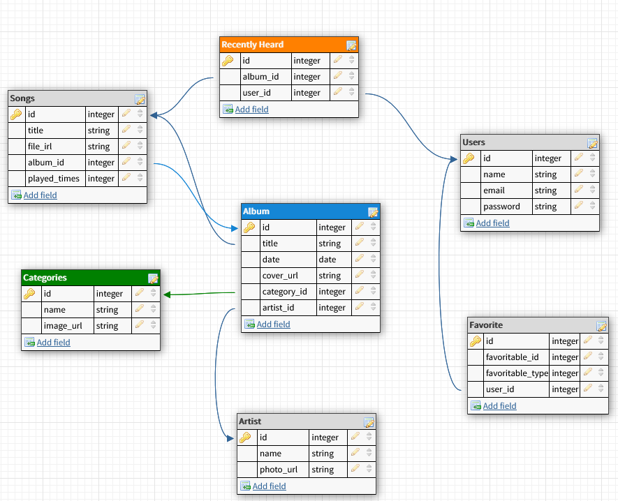

[](https://github.com/RianNegreiros/spotify-clone/actions/workflows/rubyonrails.yml)

# Spotify Clone

MVP application inspired on [Spotify](https://spotify.com) built with Ruby On Rails and Reactjs


## Users should be able to:

* Listen to your songs by your favorite style.

* Listen to recently played songs.

* Listen to recommended songs.

* Check out the songs separated by albums and artists and their different styles.

* Favorite songs, albums and artists and check this list.

* Play songs randomly.

* Search by name: |Music| |Artist| |Album|.

* Login and registration.

## How to Run

### Pre Requirements

- [Ruby 3.0.0](https://www.ruby-lang.org/en/news/2020/12/25/ruby-3-0-0-released/)
- [Rails 6.0.3.3](https://rubygems.org/gems/rails/versions/6.0.3.3)
- [Node 15.0.1](https://nodejs.org/en/blog/release/v15.0.1)
- [SQLite](https://www.sqlite.org/index.html)

### On project folder:

1. Install the dependencies:
```bash
yarn install
bundle install
```

2. Setup the database:
```bash
rails db:create
rails db:migrate
```

 - ***Optionally*** you can seed the database with dummy data
  1. Download the [dummy data](https://www.dropbox.com/scl/fo/z128ovtt6oaghzbb5o8o7/h?dl=0&rlkey=aeddj8ozdb4hxq099f3wbka6e)
  2. Copy the content to tmp/seed_files
  3. Seed the database
   ```bash
  rails db:seed
  ```

3. Install webpacker:
```bash
bundle exec rails webpacker:install
```

4. Run the application:
```bash
rails s
```

### Database Schema



## Built with:

* [Ruby on Rails](http://www.dropwizard.io/1.0.2/docs/) - The Ruby on Rails framework for API

* [React](https://github.com/facebook/react/blob/master/README.md) - React is a JavaScript library used for user interface.

* [Web Packer Rails](https://github.com/rails/webpacker) - Web Packer Rails

* [JBuilder](https://github.com/rails/jbuilder/blob/master/README.md) - JSON structures that beats manipulating giant hash structures

* [Devise](https://github.com/heartcombo/devise) - Flexible authentication solution for Rails with Warden

* [Rack-cors](https://github.com/cyu/rack-cors) - Rack Middleware for handling Cross-Origin Resource Sharing (CORS)

* [Toast-rails](https://github.com/tylergannon/toastr-rails) - Messages beautiful based toasttrjs
